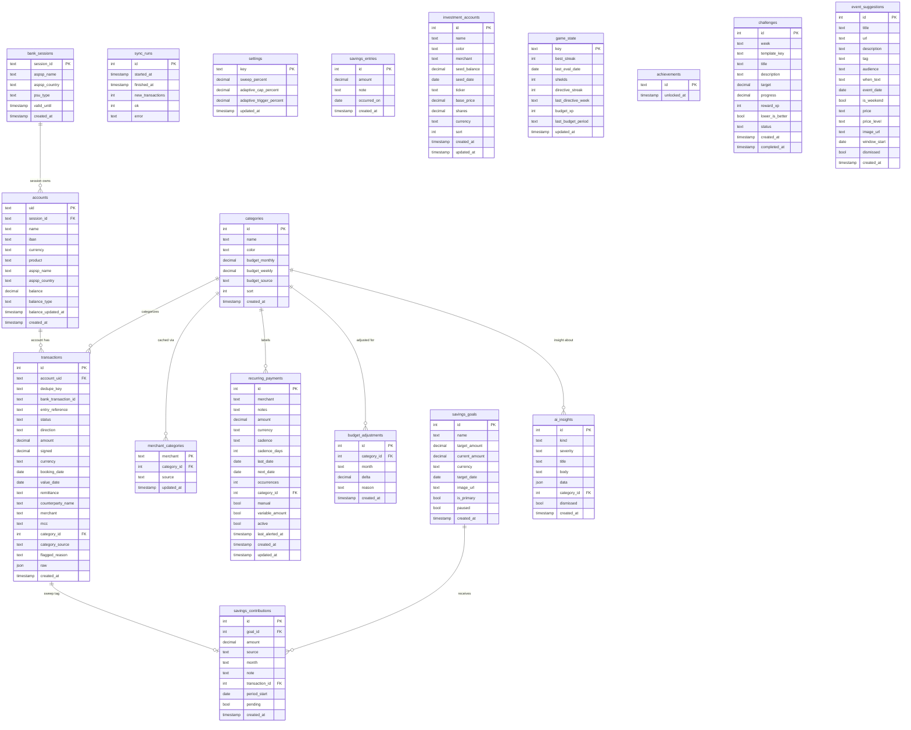

# MWFinance

Personal finance terminal for Länsförsäkringar Bank. Connects via the Enable Banking Open Banking API, auto-categorizes transactions with Gemini AI, tracks salary-cycle budgets, manages savings goals, surfaces behavioral insights, and runs a **Reactor Core gamification system** that turns financial discipline into escalating XP.

**Stack:** Next.js 15 (App Router) · Drizzle ORM · Neon Postgres · Enable Banking (RS256 JWT) · Gemini 2.5 Flash · ntfy push · Tailwind · Vercel

---

## Database Schema

18 tables across 6 domains. All timestamps are `timestamptz`; monetary values are `numeric(14,2)` (SEK). Singletons (`settings`, `game_state`) use a fixed `key = 'singleton'` primary key.




---

## Features

### Finance

- **Auto-sync** from Länsförsäkringar via cron (daily + weekly) or manual trigger. Full streaming log with per-transaction categorization detail.
- **Categorization pipeline**: self-transfer detection, MCC codes, keyword rules, merchant cache, Gemini fallback. Manual overrides propagate to all past and future transactions from the same merchant.
- **Salary-cycle budgeting**: budget periods run from your last salary deposit to the next one (detected as Income 18k-30k kr), not calendar months.
- **AI budget recalibration**: Gemini analyzes spending + recurring bills, proposes a full budget. Manual edits are never overwritten.
- **Conversational AI assistant**: terminal-style console on `/assistant`.
- **Behavioral analysis**: nightly Gemini batch produces AI insights on the overview.
- **Investment tracking**: per-account balance tracker (Lysa, Avanza, LF Fonder). Balance = seed + DBIT outflows minus CRDT inflows matching the account merchant name.
- **Recurring payments**: auto-detected (3+ consistent charges) + manually markable. Variable-price support.
- **Anomaly detection**: suspicious payments flagged `[!] ANOMALY`.
- **Savings goals** with Vercel Blob images, time-to-goal projections, and a **salary-period sweep**: when a new salary lands, the app computes budget surplus over the just-closed period and records a *pending* sweep suggestion (sweep % of slack) toward the primary goal. You then make the real Lysa transfer and tag that transaction as the sweep from the ledger (`[→ sweep]`), which confirms the suggestion with the real amount and credits the goal.
- **What-if simulator**: adjust category budgets and see projected month-end impact.
- **Adaptive budgeting**: large purchases tighten other categories automatically (net-zero redistribution).

### Reactor Core (Phase 5 Gamification)

Financial discipline powers a reactor core. XP is derived live from real financial data and can never drift.

**XP Formula:**
```
floor(investments / 100) × 10 XP       (sole capital driver — Investments box total: seed + txns)
streak days × (40 + days × 5) XP       (+5 XP/day rate increase per day of streak)
budget: 3 XP per 100 kr under budget at end of salary cycle
+ achievement XP + challenge XP
```

**Streak scaling examples:**
| Streak | XP/day | Total streak XP |
|--------|--------|-----------------|
| 7d | 75 | 525 |
| 14d | 110 | 1 540 |
| 30d | 190 | 5 700 |
| 60d | 340 | 20 400 |
| 100d | 540 | 54 000 |
| 365d | 1 865 | 680 725 |

**Output tiers** (cumulative XP thresholds):
| Tier | XP | Visual |
|------|-----|--------|
| COLD | 0 | Dormant cold-iron sphere |
| EMBER | 500 | Single glowing ember, rising particles |
| IGNITION | 1 500 | Turbulent fire core, spark jets |
| STABLE | 3 500 | Ordered green rings, balanced orbits |
| CRITICAL | 7 000 | Amber, energy arcs, warning ticks |
| OVERDRIVE | 12 000 | Violent red plasma, lightning, shaking |
| FUSION | 20 000 | Blazing star, corona rays, lens flare |
| SINGULARITY | 35 000 | Black hole: event horizon + accretion disk |
| QUASAR | 55 000 | Black hole firing bipolar relativistic jets |
| BIG BANG | 90 000 | A universe igniting: expanding shockwaves + ejecta |
| OMNIVERSE | 150 000 | Nested fractal realities, hue-shifting mandala |
| OBLIVION | 250 000 | Spiked flashing crimson blades around an ominous void core |

**Shields:** earn 1 per completed 7-day streak block (max 3). A breach consumes a shield rather than resetting uptime.

**Weekly directives (5 challenges):** Hold Containment, Dark Reactor, Cold Kitchen, Deploy Capital, Fuel the Reserve. Resolve on eval or nightly after sync.

**39 achievements** spanning investment/wealth milestones, streak milestones, directive streaks, capacitor charges and tier reaches (up to "Annihilation" +35k XP for OBLIVION, "Transcendent" +20k XP, "Fund Manager" +12k XP for 1M invested). Investing is the sole capital track; savings does not fuel the reactor.

**Reactor eval** runs after every sync. Manual trigger on `/rank`. Streak eval, challenge resolution, achievement unlocks, shield awards, investment-spike detection and ntfy alerts all happen here.

Preview all 8 animated reactor cores at **`/rank?dev=1`**.

---

## Setup

### Prerequisites

- Node 20+
- [Neon](https://neon.tech) Postgres (free tier works)
- Enable Banking application with RSA key pair and your bank's ASPSP name
- [Gemini API key](https://aistudio.google.com/apikey) (billing enabled)
- [ntfy](https://ntfy.sh) app on your phone

### Install

```powershell
npm install
Copy-Item .env.example .env.local
# fill in .env.local
```

### Enable Banking private key

```powershell
# Convert PKCS#1 to PKCS#8 if needed
openssl pkcs8 -topk8 -nocrypt -in your-key.pem -out pkcs8.pem
# Base64-encode, no line wraps
[Convert]::ToBase64String([IO.File]::ReadAllBytes("pkcs8.pem")) | Set-Content key.b64
```

Paste `key.b64` into `ENABLE_BANKING_PRIVATE_KEY_BASE64`.

### Database

```powershell
npm run db:push     # create schema from Drizzle
npm run db:seed     # default categories
```

Then run all migrations in the Neon SQL editor (all idempotent, safe to re-run):

```sql
-- paste and run each file in order:
drizzle/migrations/phase2.sql
drizzle/migrations/phase3.sql
drizzle/migrations/phase4.sql
drizzle/migrations/phase4-ticker.sql
drizzle/migrations/phase5.sql          -- Reactor Core game tables
drizzle/migrations/phase-sweep.sql     -- salary-period sweep + Lysa tx tagging
```

> `phase5.sql` creates `game_state`, `achievements`, `challenges` and drops
> any Phase 5a experiment columns (`hourly_rate`, `discretionary`, `reflections`).
> The file is idempotent. Run it even on a fresh install.

### Run

```powershell
npm run dev         # http://localhost:3000
```

Click `$ sync now` on the overview, complete BankID, and transactions start flowing.

---

## Environment Variables

| Variable | Required | Description |
|---|---|---|
| `DATABASE_URL` | yes | Neon Postgres connection string |
| `ENABLE_BANKING_PRIVATE_KEY_BASE64` | yes | Base64 PKCS#8 RSA private key |
| `ENABLE_BANKING_APP_ID` | yes | Enable Banking application ID |
| `ENABLE_BANKING_REDIRECT_URL` | yes | Must match Enable Banking panel |
| `ENABLE_BANKING_ASPSP_NAME` | yes | e.g. `Lansforsakringar` |
| `ENABLE_BANKING_ASPSP_COUNTRY` | yes | e.g. `SE` |
| `GEMINI_API_KEY` | yes | Google AI Studio (billing must be enabled) |
| `GEMINI_MODEL` | no | defaults to `gemini-2.5-flash` |
| `NTFY_SERVER` | no | defaults to `https://ntfy.sh` |
| `NTFY_TOPIC` | yes | your private ntfy topic |
| `BLOB_READ_WRITE_TOKEN` | yes | Vercel Blob (goal images) |
| `CRON_SECRET` | yes | Bearer token for cron-guarded routes |
| `APP_URL` | yes | public base URL e.g. `https://mw-finance.vercel.app` |
| `SITE_PASSWORD` | no | enables password lock on all mutations; unset = open |
| `FINNHUB_API_KEY` | no | stock quotes for investment accounts |

---

## Key Source Files

### Finance core
| File | Role |
|---|---|
| `src/db/schema.ts` | Drizzle schema (all tables + type exports) |
| `src/db/seed.ts` | 14 default categories |
| `src/lib/env.ts` | Typed env access (lazy, server-only) |
| `src/lib/enablebanking/normalize.ts` | Raw transaction → DB row (dedupe key, merchant) |
| `src/lib/categorize.ts` | MCC + keyword rules + Gemini classifier |
| `src/lib/sync.ts` | Full sync orchestration |
| `src/lib/budget.ts` | Salary-cycle budget status |
| `src/lib/period.ts` | `getSalaryCycle`, `getAllSalaryCycles` |
| `src/lib/savings.ts` | Goals, contributions, salary-period sweep (`runPeriodSweep`, `classifyTransactionAsSweep`), savings total |
| `src/lib/investments.ts` | Investment accounts (seed + txn delta), `getInvestmentAccountsTotal` (reactor invested source) |
| `src/lib/behavior/` | Recurring detection, anomaly flagging, adaptive budgets |
| `src/lib/gemini/` | Context builder, assistant, budget recalibration, analysis |

### Reactor Core game engine (`src/lib/game/`)
| File | Role |
|---|---|
| `level.ts` | XP formula (scaling streak, investment-only capital), 12 tiers, `computeXp`, `levelFromXp` |
| `pace.ts` | Daily pace (budget / cycle days), daily spend map, week/ISO-week helpers |
| `streak.ts` | Containment uptime, `getStreakAsOf` for shield absorption |
| `pot.ts` | Stored charge capacitor (weekly under-pace surplus) |
| `history.ts` | 42/84-day containment log data (`getDayHistory`) |
| `velocity.ts` | Next-milestone tracker (closest not-yet-unlocked achievement by % remaining) |
| `achievements.ts` | 39 badge definitions + predicates, unlock persistence |
| `challenges.ts` | 5 weekly directive templates, generation, eval |
| `snapshot.ts` | `getReactorSnapshot`: assembles full game state for pages |
| `eval.ts` | `runGameEval`: streak, shields, directives, achievements, ntfy |

### UI
| File | Role |
|---|---|
| `app/ui/ReactorCore.tsx` | 12 bespoke animated SVG cores (Cold through Oblivion) |
| `app/ui/ReactorStatus.tsx` | Overview panel: core badge + stats |
| `app/ui/ReactorDevPanel.tsx` | `/rank?dev=1` previewer for all 12 tiers |
| `app/ui/FuelRods.tsx` | 42-day fuel-rod containment log (interactive, animated) |
| `app/ui/XpBreakdown.tsx` | Per-source XP breakdown with scaling streak detail |
| `app/ui/AchievementBadge.tsx` | Animated hexagonal badge (glow + rotating ring) |
| `app/ui/Tip.tsx` | Click-to-toggle info tooltip |
| `app/rank/page.tsx` | `/rank`: full reactor view, all panels |

---

## API Routes

| Route | Methods | Description |
|---|---|---|
| `/api/auth/start` | GET | Begin BankID consent |
| `/api/auth/unlock` | POST | Password unlock (sets JWT cookie) |
| `/api/callback` | GET | OAuth exchange, persist session + accounts |
| `/api/sync` | GET | Cron target, Bearer-guarded by `CRON_SECRET` |
| `/api/sync/manual` | POST | Streaming manual sync |
| `/api/categorize` | POST | Streaming backlog re-categorization |
| `/api/transactions` | GET, PATCH | List with filters; PATCH = category override |
| `/api/transactions/[id]/sweep` | POST | Tag a DBIT tx as the Lysa sweep transfer (confirms pending suggestion → credits primary goal) |
| `/api/categories` | GET, POST, PATCH, DELETE | Category management |
| `/api/recurring` | GET, POST, PATCH | Recurring payment management |
| `/api/budget/recalibrate` | POST | Streaming AI budget proposal + apply |
| `/api/investments` | GET, POST, PATCH, DELETE | Investment accounts |
| `/api/assistant` | POST | Streaming Gemini assistant |
| `/api/analysis/run` | POST | Nightly AI behavioral analysis |
| `/api/insights/ai` | GET | Stored AI insights |
| `/api/savings` | GET, POST, DELETE | Manual savings entries |
| `/api/goals` | GET, POST | Savings goals |
| `/api/goals/[id]/contributions` | GET, POST | Goal contributions |
| `/api/goals/[id]/image` | POST | Upload goal image (Vercel Blob) |
| `/api/simulate` | POST | What-if simulation |
| `/api/candles` | GET | Finnhub OHLCV candles |
| `/api/quote` | GET | Finnhub real-time quote |
| `/api/game/eval` | GET, POST | Reactor eval (GET = cron/Bearer, POST = streaming manual) |

---

## Deploy to Vercel

1. Push to Git and import into Vercel.
2. Add all env vars in Project > Settings > Environment Variables. Set `APP_URL` and `ENABLE_BANKING_REDIRECT_URL` to your prod domain; register that URL in Enable Banking.
3. `vercel.json` defines cron schedules for `/api/sync` and `/api/analysis/run`. Vercel injects `Authorization: Bearer $CRON_SECRET` automatically.
4. Run all DB migrations in Neon (see Database section).

---

## Scripts

```
npm run dev           dev server
npm run build         production build
npm run typecheck     tsc --noEmit
npm run db:push       push Drizzle schema
npm run db:seed       seed categories
npm run db:studio     Drizzle Studio (DB browser)
```

---

## Security

- `.env.local` and `*.pem` are gitignored. Never commit secrets.
- RSA key lives only in env. Rotate via the Enable Banking panel.
- `/api/sync` and `/api/game/eval` GET are protected by `CRON_SECRET` bearer check.
- `SITE_PASSWORD` enables session-cookie auth on all mutating routes.
- Use an unguessable `NTFY_TOPIC`; anyone who knows it can read your push notifications.
